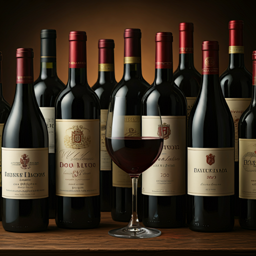
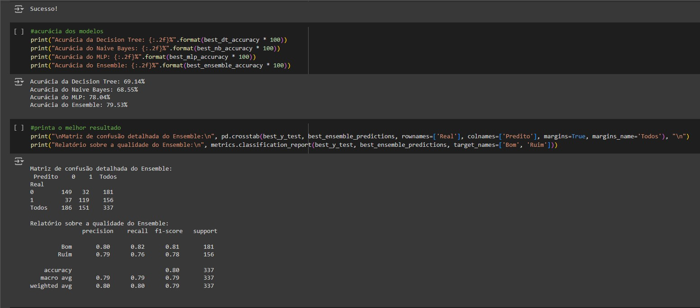

# O Vinho Perfeito

Projeto acadêmico realizado no semestre 2023-1, na unidade curricular de Inteligência Artificial utilizando Python. O objetivo deste projeto foi desenvolver um sistema preditivo para identificar as melhores combinações de características químicas que resultam em vinhos de alta qualidade. Para isso, foram aplicadas diversas técnicas de manipulação de dados e modelos de aprendizado de máquina. O foco principal foi prever a qualidade dos vinhos tintos com base em atributos como pH, acidez fixa, teor alcoólico, entre outros.

Modelos Preditivos: Três algoritmos de aprendizado supervisionado foram escolhidos para a tarefa: Árvore de Decisão (Decision Tree), Naive Bayes e MLPClassifier (Perceptron Multicamadas). O conjunto de dados foi obtido do site UCI Machine Learning Repository (https://archive.ics.uci.edu/), contendo características de vinhos tintos avaliados de 0 a 10 (https://archive.ics.uci.edu/ml/machine-learning-databases/wine-quality/winequality-red.csv). Decidimos considerar vinhos com nota 6 ou mais como "bons" e os abaixo dessa nota como "ruins", transformando o problema em uma classificação binária.

### Principais etapas do projeto:

Tratamento de Dados: O primeiro passo foi trabalhar com o dataset (dataframe com as informações do vinho), removendo linhas com dados faltantes, valores nulos e outliers que poderiam distorcer os resultados. Também realizamos uma normalização para garantir que todos os valores numéricos ficassem dentro de uma faixa comum, como de 0 a 1, utilizando o Normalizer. Isso ajuda a evitar enviesamento, um aspecto crucial na construção de IA.

Treinamento e Previsão: Dividimos o dataset em características (X) e respostas (y) com o código train_test_split(Xz, y, test_size=0.3). A partir disso, realizamos a separação em dados de treino e teste (70% treino, 30% teste). Treinamos os três modelos e utilizamos um esquema de votação para combinar as previsões de cada um, determinando a qualidade final do vinho com base na maioria dos votos, formando um ensemble (comitê).

Visualização e Avaliação: Coletamos métricas como a melhor acurácia (geralmente em torno de 79%), média, mediana, desvio padrão, entre outras, e utilizamos esses dados para gerar gráficos de dispersão, matrizes de confusão e outros diagramas que ajudaram a entender o desempenho dos modelos. Também fizemos análises com base nos dados do dataset para verificar as características mais relevantes de vinhos classificados como bons ou ruins.

Foram realizados 2000 testes para encontrar o melhor ensemble (comitê), que salva as 3 IAs em arquivos .joblib. Por fim, construímos vinhos fictícios, bons e ruins, a partir dos dados analisados, para testar as IAs. O resultado mostrou que o ensemble das três IAs foi eficiente em prever a qualidade dos vinhos com base nas características químicas analisadas.

### Código e Execução:

O código principal está disponível nos formatos comite.ipynb e comite.py neste repositório GitHub. Ambos os formatos têm o mesmo conteúdo e podem obter o dataset diretamente do site mencionado ou, se preferir, importar o arquivo winequality-red.csv, que também está disponível no repositório. Também estão disponíveis os códigos das três IAs testadas individualmente na pasta ia_individuais: decisiontree.ipynb e decisiontree.py para a árvore de decisão, naivebayes.ipynb e naivebayes.py para o Naive Bayes, e mlp.ipynb e mlp.py para o MLP Classifier. 

Para executar o código no Visual Studio Code, utilize a extensão Jupyter e instale as bibliotecas necessárias com o comando (python -m pip install scikit-learn pandas numpy matplotlib seaborn joblib requests) no terminal. É possível acessar o projeto principal (comite.ipynb) diretamente no Google Colab (https://colab.research.google.com/drive/1lFPA-AQOluPRp2Xf0xjUrfg-WH-Q4cDj?usp=sharing).

### Exemplo:

